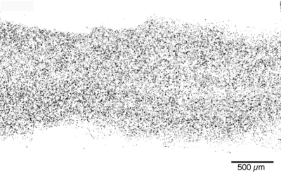

{:style="width: 675px; float: right; margin-right: -50px; margin-top: 6px; margin-left: -30px, margin-bottom: 0px"}
Ciliated tissues need to accommodate a variety of specialized cell types, thus ciliated cells do not cover surfaces uniformly. Yet, we do not understand how can discontinuous carpets of cilia generate long-range flows. Combining measurements of cilia organization in the mouse airway with a reduced order hydrodynamic model, I studied how spatial organization of cilia integrates across scales to produce a directed flow. 

I found that less than half of the total surface of the trachea is covered by ciliated cells, furthermore there is a surprisingly high level of heterogeneity in the orientation of cilia within individual cells and across the tissue. Despite local heterogeneities in both cilia organization and flow structure, fluid transport is coherent and globally directed across the trachea. If you are curious about the mechanisms that allow a disordered ciliary carpet to generate directed flows you can find the details in this [preprint](https://www.biorxiv.org/content/10.1101/665125v1){:target="_blank"}. 