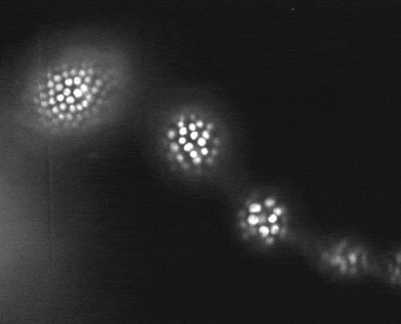

{:style="width: 500px; float: right; margin-right: -50px; margin-top: 6px; margin-left: -30px, margin-bottom: 0px"}
Morphogenesis requires tissues to establish asymmetries across several spatial scales. During the development of Drosophila egg chambers, alignment of actin bundles in the epithelium and collagen fibrils in the extra-cellular-matrix (ECM) was hypothesized to deform the egg chamber, changing its shape from a spherical to elliptical. A collective migration of the cells in the entire tissue was thought to align the actin and collagen networks. By imaging egg chamber migration we discovered that actin alignment and migration are decoupled from egg chamber elongation and ECM orientation, challenging the morphogenesis paradigm. Using new metrics to assess orientation of the different networks and genetic perturbations we untangled the relationship between migration, ECM and actin alignment. You can read more about our findings [here](https://doi.org/10.1038/ncomms6511){:target="_blank"}.
