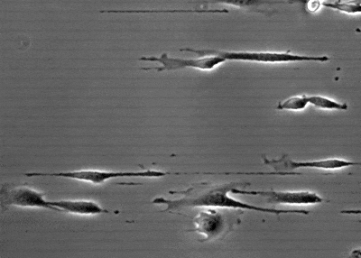

{:style="width: 500px; float: right; margin-right: -50px; margin-top: 6px; margin-left: -30px, margin-bottom: 0px"}
How cells migrate is influenced by the physical properties of their environment, in particular by the extracellular matrix (ECM). During contact guidance, alignment of the ECM guides cell shape and migration direction. This phenomenon was first described in the 1950s, however, my work was the first to elucidate the mechanism for this cellular response. I engineered substrates that mimicked aligned ECM. Using this setup, I showed that cells elongate and migrate parallel to the ECM in response to single micrometer changes in ECM geometry. By quantifying cellular phenotypes and perturbing the regulation of the major pathways involved in cell migration, I showed that protrusion orientation by structured ECM results in directed migration. You can read more about the biophysical mechanisms of contact guidance [here](https://doi.org/10.1091/mbc.e16-11-0769){:target="_blank"}.